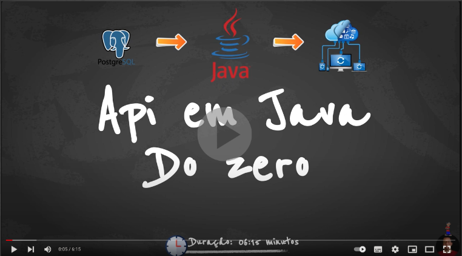

# Mini Curso em Java 21

# Objetivo

Criar uma api em Java 21 com Spring 3 e salvar, deletar e atualizar uma entity no banco postgresSql.

# Tecnologias
* Java 21
* Spring 3
* Gradle
* InteliJ
* PostgreSql
* Docker e Docker-Compose
* Jpa

# Estrutura do projeto

